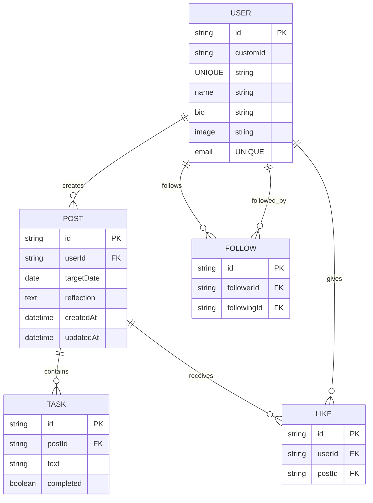

```mermaid
erDiagram
    USER ||--o{ POST : creates
    USER ||--o{ FOLLOW : follows
    USER ||--o{ FOLLOW : followed_by
    USER ||--o{ LIKE : gives
    POST ||--o{ TASK : contains
    POST ||--o{ LIKE : receives

    USER {
        string id PK
        string customId UNIQUE
        string name
        string bio
        string image
        string email UNIQUE
    }

    POST {
        string id PK
        string userId FK
        date targetDate
        text reflection
        datetime createdAt
        datetime updatedAt
    }

    TASK {
        string id PK
        string postId FK
        string text
        boolean completed
    }

    FOLLOW {
        string id PK
        string followerId FK
        string followingId FK
    }

    LIKE {
        string id PK
        string userId FK
        string postId FK
    }
```
