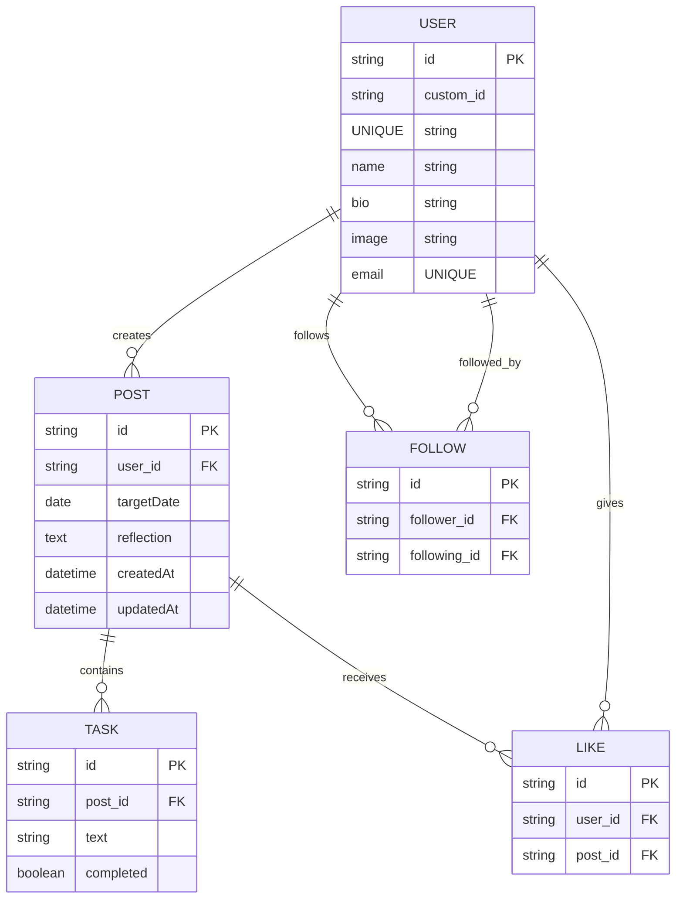

なんかところどころgithubのer図がバグってるから注意

postsテーブルに対してtasksは何個でも作れるから一つに独立できる。
post_idにunique制約がないからできるこれが1対n
仮に１投稿１タスクにしたい場合　post_id uuid unique references posts(id)　のようにすると同じpost_idを使えないため
| id | post_id | text  |
| -- | ------- | ----- |
| 1  | A       | SQL勉強 |
| 2  | A       | ジム行く  |
| 3  | A       | 読書    |

のようにできなくなる
uniqeすげー💖
